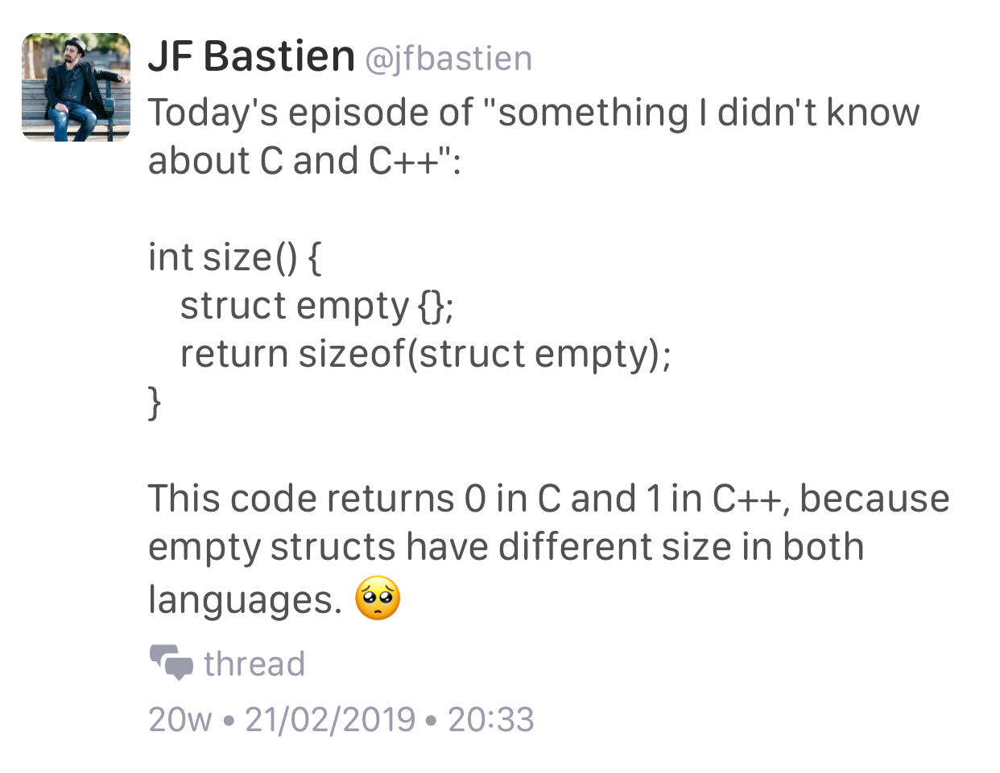

# "Making new friends" idiom by Dan Saks

[Wikibooks](https://en.wikibooks.org/wiki/More_C%2B%2B_Idioms/Making_New_Friends)

> The goal is to simplify creation of friend functions for a class template.

```cpp
template<typename T>
class Foo {
   T value;
public:
   Foo(const T& t) { value = t; }
   friend ostream& operator <<(ostream& os, const Foo<T>& b)
   {
      return os << b.value;
   }
};
```

# Video: Secure Programming Practices in C++ - NDC Security 2018

[YouTube](https://www.youtube.com/watch?v=Jh0G_A7iRac)

# Video: C++ Performance and Optimisation - NDC Techtown 2017

[YouTube](https://www.youtube.com/watch?v=eICYHA-eyXM)

# Video: Concurrent Programming in C++ - NDC Techtown 2017

[YouTube](https://www.youtube.com/watch?v=O7gUNNYjmsM)

# Video: CppCon 2016: "C++14 Reflections Without Macros, Markup nor External Tooling"

[YouTube](https://www.youtube.com/watch?v=abdeAew3gmQ)

# How to Adopt Modern C++17 into Your C++ Code, by Herb Sutter

* [YouTube](https://www.youtube.com/watch?v=UsrHQAzSXkA)

# Type Erasure by Andrzej

* [Part 1](https://akrzemi1.wordpress.com/2013/11/18/type-erasure-part-i/)
* [Part 2](https://akrzemi1.wordpress.com/2013/12/06/type-erasure-part-ii/)
* [Part 3](https://akrzemi1.wordpress.com/2013/12/11/type-erasure-part-iii/)
* [Part 4](https://akrzemi1.wordpress.com/2014/01/13/type-erasure-part-iv/)

# Type Erasure with Merged Concepts

* [Post by Andreas Herrmann](https://aherrmann.github.io/programming/2014/10/19/type-erasure-with-merged-concepts/)

# On the Tension Between Object-Oriented and Generic Programming in C++, and What Type Erasure Can Do About It

* [Article by Thomas Becker](https://www.artima.com/cppsource/type_erasure.html)

# Using metaprogramming for PIMPL idiom

* [Reddit](https://www.reddit.com/r/cpp/comments/7971ws/using_metaprogramming_for_pimpl_idiom/)

# A hidden gem: `inner_product`

* [Article](https://marcoarena.wordpress.com/2017/11/14/a-hidden-gem-inner_product/)

# Your own type predicate

* [Part 1](https://akrzemi1.wordpress.com/2017/12/02/your-own-type-predicate/)
* [Part 2](https://akrzemi1.wordpress.com/2017/12/20/a-friendly-type-predicate/)

# Tick: Trait introspection and concept creator for C++11

* [GitHub](https://github.com/pfultz2/Tick)

# Converting enum classes to strings and back in C++

* [Article](https://sheep.horse/2018/5/converting_enum_classes_to_strings_and_back_in_c++.html)
* [Reddit](https://www.reddit.com/r/cpp/comments/8hwk91/converting_enum_classes_to_strings_and_back_in_c/)

# Unreal Engine Gameplay Framework Primer for C++

* [Article](http://www.tomlooman.com/ue4-gameplay-framework/)

# Rvalues redefined

* [Post](https://akrzemi1.wordpress.com/2018/05/16/rvalues-redefined/)

# eventpp -- C++ library for event dispatcher and callback list

* [GitHub](https://github.com/wqking/eventpp)

# Multifunction: Generalization of `std::function` for any number of signatures

* [Code](https://github.com/fgoujeon/multifunction)

# How to Use Tag Dispatching In Your Code Effectively

* [Post](http://www.fluentcpp.com/2018/04/27/tag-dispatching/)

# Declarative Functional APIs – A.K.A. Abusing Lambda Parameters

* [Post](https://philippegroarke.com/blog/2018/05/19/declarative-functional-apis-a-k-a-abusing-lambda-parameters/?utm_source=newsletter_mailer&utm_medium=email&utm_campaign=weekly)

# Embracing Algorithms, by Dave Abrahams (WWDC2018)

* [Video](https://developer.apple.com/videos/play/wwdc2018/223/)
* [Reddit](https://www.reddit.com/r/cpp/comments/8pqtr1/dave_abrahams_on_embracing_algorithms_at_wwdc_2018/)

> I guess most of you know who Dave Abrahams is and what he has done in the C++ community. He switched gears a little and is now working at Apple focusing mostly on the development of the Swift language and its library. However, yesterday he gave an excellent talk at their Developer Conference entitled Embracing Algorithms, which IMHO is general enough to be of interest for C++ developers as well. The link has a video of that 40 minutes long talk as well as the slides.

# Matt Godbolt (2017-06-27) - Memory and Caches

* [Video](https://www.youtube.com/watch?v=vDns3Um39l0)

# Florent Castelli: Introduction to CMake

[Video](https://www.youtube.com/watch?v=jt3meXdP-QI)

# A Universal Async Abstraction for C++

[Corentin Jabot](https://cor3ntin.github.io/posts/executors/)

[P0443R11 The Unified Executors Proposal](https://wg21.link/P0443R11)

# Expression templates, ranges, and coroutines

* [Wikipedia](https://en.wikipedia.org/wiki/Expression_templates)
* [We don’t need no stinking expression templates](https://gieseanw.wordpress.com/2019/10/20/we-dont-need-no-stinking-expression-templates/) by Andy G
  * [Reddit](https://www.reddit.com/r/cpp/comments/dkmbud/we_dont_need_no_stinking_expression_templates/)

# Change standard containers' `size()` method to return signed integer?

[Reddit](https://www.reddit.com/r/cpp/comments/dl7lcu/change_stl_containers_size_method_to_return/)

# Is requiring lambdas to explicitly list what they capture a good coding standard?

[Reddit](https://www.reddit.com/r/cpp/comments/dp8p2u/is_requiring_lambdas_to_explicitly_list_what_they/)

# Towards a standard unit systems library

[P1930R0](http://www.open-std.org/jtc1/sc22/wg21/docs/papers/2019/p1930r0.pdf)

[Reddit](https://www.reddit.com/r/cpp/comments/dpmsfg/towards_a_standard_unit_systems_library/)

[Robert Ramey](https://www.reddit.com/r/cpp/comments/dpmsfg/towards_a_standard_unit_systems_library/f5xh1oe?utm_source=share&utm_medium=web2x):

> The value of a paper like this would be to narrow the scope or domain of a problem to something that would be useful component in solving bigger problems. This paper does the opposite - expanding the domain to encompass the whole world of physics.

# C++ `std::string_view` for better performance: An example use case

[Article](https://www.nextptr.com/tutorial/ta1217154594/cplusplus-stdstring_view-for-better-performance-an-example-use-case)

[Reddit](https://www.reddit.com/r/cpp/comments/dosgnp/c_stdstring_view_for_better_performance_an/)

[Arthur O'Dwyer: `std::string_view` is a borrow type](https://quuxplusone.github.io/blog/2018/03/27/string-view-is-a-borrow-type/)

> Borrow types are essentially “borrowed” references to existing objects. They lack ownership; they are short-lived; they generally can do without an assignment operator. They generally appear only in function parameter lists; because they lack ownership semantics, they generally cannot be stored in data structures or returned safely from functions.

[cppreference: `std::basic_string_view` (C++17)](https://en.cppreference.com/w/cpp/string/basic_string_view)

# Scott Meyers's guideline "Make non-leaf classes abstract"

[Reddit](https://www.reddit.com/r/cpp/comments/dz26kd/should_we_reevaluate_scott_meyerss_guideline_make/)

# Empty struct size in C and C++



# Hello World with C++2a modules

[Arthur O'Dwyer](https://quuxplusone.github.io/blog/2019/11/07/modular-hello-world/)

> Here’s how to build a “Hello world” program using Clang’s implementation of C++2a Modules, as it currently stands as of November 2019.

[Reddit](https://www.reddit.com/r/cpp/comments/dtbqe9/hello_world_with_c2a_modules/)

# JSON Library from the makers of Boost.Beast

Vinnie Falcou:

> A survey of existing JSON libraries shows impressive diversity and features. However, no library is known to meet all of the design goals mentioned here. In particular, we know of no library that supports incremental parsing and serialization, and also supports custom allocators robustly.

[Reddit](https://www.reddit.com/r/cpp/comments/e42ovz/new_json_library_from_the_makers_of_boostbeast/) --- [GitHub](https://github.com/vinniefalco/json/) (C++11, Boost License) --- [Docs](http://vinniefalco.github.io/doc/json/index.html) --- [Benchmarks](http://vinniefalco.github.io/doc/json/json/benchmarks.html)

> This is currently NOT an official Boost library.

# Beginner's Guide to Linkers

[http://www.lurklurk.org/linkers/linkers.html](http://www.lurklurk.org/linkers/linkers.html)

```bash
g++ -o test1 test1a.o test1b.o
test1a.o(.text+0x18): In function `main':
: undefined reference to `findmax(int, int)'
collect2: ld returned 1 exit status
```

> If your reaction to this is 'almost certainly missing extern "C"' then you probably already know everything in this article.
