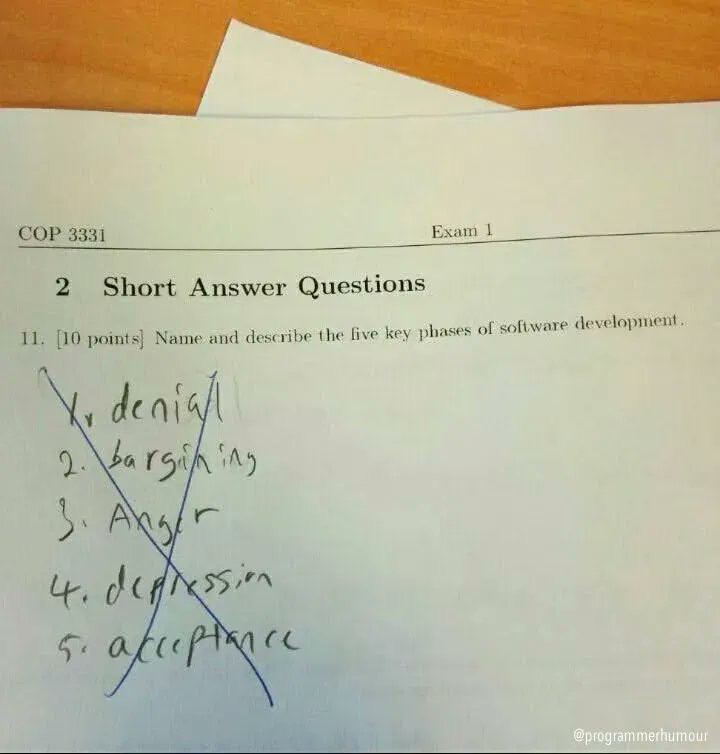
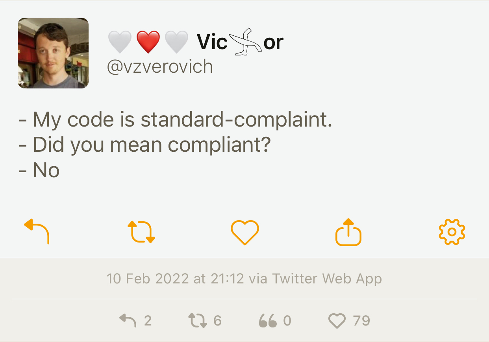

# Stash

## Video: Secure Programming Practices in C++ - NDC Security 2018

[YouTube](https://www.youtube.com/watch?v=Jh0G_A7iRac)

## Video: C++ Performance and Optimisation - NDC Techtown 2017

[YouTube](https://www.youtube.com/watch?v=eICYHA-eyXM)

## Video: Concurrent Programming in C++ - NDC Techtown 2017

[YouTube](https://www.youtube.com/watch?v=O7gUNNYjmsM)

## Video: CppCon 2016: "C++14 Reflections Without Macros, Markup nor External Tooling"

[YouTube](https://www.youtube.com/watch?v=abdeAew3gmQ)

## How to Adopt Modern C++17 into Your C++ Code, by Herb Sutter

* [YouTube](https://www.youtube.com/watch?v=UsrHQAzSXkA)

## Using metaprogramming for PIMPL idiom

* [Reddit](https://www.reddit.com/r/cpp/comments/7971ws/using_metaprogramming_for_pimpl_idiom/)

## Your own type predicate

* [Part 1](https://akrzemi1.wordpress.com/2017/12/02/your-own-type-predicate/)
* [Part 2](https://akrzemi1.wordpress.com/2017/12/20/a-friendly-type-predicate/)

## Tick: Trait introspection and concept creator for C++11

* [GitHub](https://github.com/pfultz2/Tick)

## Converting enum classes to strings and back in C++

* [Article](https://sheep.horse/2018/5/converting_enum_classes_to_strings_and_back_in_c++.html)
* [Reddit](https://www.reddit.com/r/cpp/comments/8hwk91/converting_enum_classes_to_strings_and_back_in_c/)

## Rvalues redefined

* [Post](https://akrzemi1.wordpress.com/2018/05/16/rvalues-redefined/)

## eventpp -- C++ library for event dispatcher and callback list

* [GitHub](https://github.com/wqking/eventpp)

## Multifunction: Generalization of `std::function` for any number of signatures

* [Code](https://github.com/fgoujeon/multifunction)

## How to Use Tag Dispatching In Your Code Effectively

* [Post](http://www.fluentcpp.com/2018/04/27/tag-dispatching/)

## Embracing Algorithms, by Dave Abrahams (WWDC2018)

* [Video](https://developer.apple.com/videos/play/wwdc2018/223/)
* [Reddit](https://www.reddit.com/r/cpp/comments/8pqtr1/dave_abrahams_on_embracing_algorithms_at_wwdc_2018/)

> I guess most of you know who Dave Abrahams is and what he has done in the C++ community. He
> switched gears a little and is now working at Apple focusing mostly on the development of the
> Swift language and its library. However, yesterday he gave an excellent talk at their Developer
> Conference entitled Embracing Algorithms, which IMHO is general enough to be of interest for C++
> developers as well. The link has a video of that 40 minutes long talk as well as the slides.

## Matt Godbolt (2017-06-27) - Memory and Caches

* [Video](https://www.youtube.com/watch?v=vDns3Um39l0)

## David Friberg - Three interesting minor features of C++20

* [YouTube](https://youtube.com/watch?v=4AQulaRJGMc)
* [Slides](https://dfrib.github.io/presentations/2020cw50_Gbgcpp_MinorCpp20Features.html)

## Video: Timur Doumler - How C++20 changes the way we write code - Meeting C++ 2020

* [YouTube](https://youtu.be/VK-16tpFQVI)
  * [Reddit](https://www.reddit.com/r/cpp/comments/lo4z89/timur_doumler_how_c20_changes_the_way_we_write/?ref=share&ref_source=link)

## A tutorial and take on C++20 coroutines

* [David Mazières](https://www.scs.stanford.edu/~dm/blog/c++-coroutines.html)
  * [Reddit](https://www.reddit.com/r/cpp/comments/lpo9qa/my_tutorial_and_take_on_c20_coroutines_david/)

## Comparing Floating-Point Numbers Is Tricky

This is an old [article](https://bitbashing.io/comparing-floats.html) from 2017 but it's still useful and provides a good illustration of the problems with machine representation of floating-point (FP) numbers.

Good things to remember:

- Floats cannot store arbitrary real numbers, or even arbitrary rational numbers.
- Since the equations are exponential, the distance on the number line between adjacent values increases (exponentially!) as you move away from zero.

Over the course of the article the author develops and improves a function to compare two FP numbers. He starts with this code which I've seen many times in our codebases, and explains why it's wrong:

```cpp
bool almostEqual(float a, float b)
{
    return fabs(a - b) <= FLT_EPSILON;
}
```

> We would hope that we’re done here, but we would be wrong. A look at the language standards reveals that `FLT_EPSILON` is equal to the difference between 1.0 and the value that follows it. But as we noted before, float values aren’t equidistant! For values smaller than 1, `FLT_EPSILON` quickly becomes too large to be useful. For values greater than 2, `FLT_EPSILON` is smaller than the distance between adjacent values, so `fabs(a - b) <= FLT_EPSILON` will always be `false`.

Boost has FP comparison API but the author explains how it is also not quite correct. He then arrives at ULPs:

> It would be nice to define comparisons in terms of something more concrete than arbitrary thresholds. Ideally, we would like to know the number of possible floating-point values---sometimes called _units of least precision_, or ULPs---between inputs. If I have some value `a`, and another value `b` is only two or three ULPs away, we can probably consider them equal, assuming some rounding error. Most importantly, this is true regardless of the distance between `a` and `b` on the number line.

The author emphasises the fact that ULPs don't work for comparing values close to zero, but this can be handled as a special case.

The main takeaways from the article are:

When comparing floating-point values, remember:

- `FLT_EPSILON...` isn't float epsilon, except in the ranges `[-2, -1]` and `[1, 2]`. The distance between adjacent values depends on the values in question.
- When comparing to some known value---especially zero or values near it---use a fixed epsilon value that makes sense for your calculations.
- When comparing non-zero values, some ULPs-based comparison is probably the best choice.
- When values could be anywhere on the number line, some hybrid of the two is needed. Choose epsilons carefully based on expected outputs.

This article was adapted from Bruce Davison's article [_Comparing Floating Point Numbers, 2012 Edition_](https://randomascii.wordpress.com/2012/02/25/comparing-floating-point-numbers-2012-edition/).

The GoogleTest macro [`ASSERT_NEAR`](https://developer.ibm.com/articles/au-googletestingframework/#list9) uses a combination of ULPs- and epsilon-based comparisons and is the best way to compare FP values in tests against an epsilon difference.

David Goldberg's article [_What Every Computer Scientist Should Know About Floating-Point Arithmetic_](https://www.itu.dk/~sestoft/bachelor/IEEE754_article.pdf) is a required reading for all programmers. A web-based version is [here](https://docs.oracle.com/cd/E19957-01/806-3568/ncg_goldberg.html).

The corresponding Reddit thread is [here](https://www.reddit.com/r/cpp/comments/tavh14/comparing_floatingpoint_numbers_is_tricky/).

A related article by John D. Cook, [_Floating point numbers are a leaky abstraction_](https://www.johndcook.com/blog/2009/04/06/numbers-are-a-leaky-abstraction/), points out a few cases when FP numbers don't behave as expected:

> Floating point numbers, the computer representations of real numbers,  are leaky abstractions. They work remarkably well: you can usually pretend that a floating point type is a mathematical real number. But sometimes you can’t. The abstraction leaks, though not very often.

### Herbie

[Herbie](https://herbie.uwplse.org) is a neat tool that simplifies arithmetic expressions to avoid FP issues.

> `sqrt(x+1) - sqrt(x) -> 1/(sqrt(x+1) + sqrt(x))`
>
> Herbie detects inaccurate expressions and finds more accurate replacements. The [left] expression is inaccurate when `x > 1`; Herbie's replacement, [right], is accurate for all `x`.

Herbie can be installed locally or used from the [web demo page](https://herbie.uwplse.org/demo/). It is programmed in [Racket](https://racket-lang.org) which looks like a Lisp-like language.

### Binary number representation cheatsheet

[Source](https://hackingcpp.com/cpp/std/numeric_limits.png)


## Xmake package management

This [article](https://github.com/xmake-io/xmake/wiki/Xmake-and-Cplusplus--Package-Management) describes package management in CMake using Vcpkg and Conan and compares it to what's available in Xmake. It also introduces Xmake's standalone package manager Xrepo. I'm still amazed at the quality and capabilities of Xmake. We lament about how difficult it is to bootstrap a C++ project, we have entire tools that boostrap CMake projects, but here it is, an easy to use and amazingly capable build system, and nobody seems to know about it. CMake is the standard, but teaching it to students is akin to starting a C++ course by explaining pointers. Xmake could be an ideal student-friendly introduction to build systems at least for their toy projects, to avoid scaring them away before they even start learning C++.

## A replacement for `std::vector<bool>`

Martin Hořeňovský [tweeted](https://mobile.twitter.com/horenmar_ctu/status/1484982737106784259):


There is also a [StackOverflow question](https://stackoverflow.com/questions/15273964/work-around-for-vectorbool-use-basic-stringbool) about that. It seems like the idea might work but you shouldn't do it. Some replies:

- "Can somebody get people like this away from the keyboard, before they hurt themselves?" --- [Jan Wilmans](https://mobile.twitter.com/janwilmans/status/1485379774860210183)
- "Somehow I equally love and hate this tweet." -- [Michail Caisse](https://mobile.twitter.com/MichaelCaisse/status/1484985164195241996)

## `nft_ptr`

Non-fungible tokens, or NFTs, are a scam built on the blockchain technology. There are many articles explaining this latest high-tech planet-destroying pyramid scheme, so I'm not going to do that here. Instead let me tell you about this excellent project that highlights the craziness from the C++ point of view. Behold `nft_ptr`: "C++ `std::unique_ptr` that represents each object as an NFT on the Ethereum blockchain."

```cpp
auto ptr1 = make_nft<Cow>();
nft_ptr<Animal> ptr2;
ptr2 = std::move(ptr1);
```

> This transfers the Non-Fungible Token `0x7faa4bc09c90`, representing the Cow's memory address, from `ptr1` (OpenSea, Etherscan) to `ptr2` (OpenSea, Etherscan).

It works, and is completely bonkers. I especially like the **Why** section:

- C++ memory management is hard to understand, opaque, and not secure.
- As we all know, adding blockchain to a problem _automatically_ makes it simple, transparent, and cryptographically secure.
- Thus, we extend `std::unique_ptr`, the most popular C++ smart pointer used for memory management, with blockchain support.
- Written in Rust for the hipster cred.
- Made with [love] by a Blockchain Expert who wrote like 100 lines of Solidity in 2017 (which didn't work).

The **Performance** section doesn't disappoint either:

> `nft_ptr` has negligible performance overhead compared to `std::unique_ptr`, as shown by this benchmark on our example program:
>
> - `std::unique_ptr` - 0.005 seconds
> - `nft_ptr` - 3 minutes

The project is very thorough and even has a link to a [whitepaper](https://github.com/zhuowei/nft_ptr/blob/main/white_paper.pdf)! It's indeed a white paper.

## Twitter

Molly Struve (@molly_struve):


An incorrect, apparently, exam answer to the question about phases of software development:



Viktor Zverovich (@vzverovich):



Patricia Aas (@pati_gallardo):


Patricia Aas again (@pati_gallardo):


## Quote


