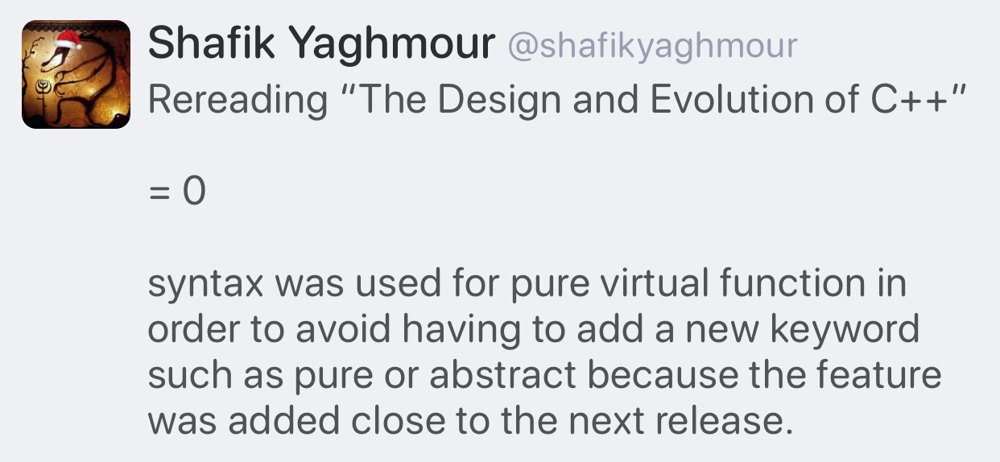

# Video: Secure Programming Practices in C++ - NDC Security 2018

[YouTube](https://www.youtube.com/watch?v=Jh0G_A7iRac)

# Video: C++ Performance and Optimisation - NDC Techtown 2017

[YouTube](https://www.youtube.com/watch?v=eICYHA-eyXM)

# Video: Concurrent Programming in C++ - NDC Techtown 2017

[YouTube](https://www.youtube.com/watch?v=O7gUNNYjmsM)

# Video: CppCon 2016: "C++14 Reflections Without Macros, Markup nor External Tooling"

[YouTube](https://www.youtube.com/watch?v=abdeAew3gmQ)

# How to Adopt Modern C++17 into Your C++ Code, by Herb Sutter

* [YouTube](https://www.youtube.com/watch?v=UsrHQAzSXkA)

# Type Erasure by Andrzej

* [Part 1](https://akrzemi1.wordpress.com/2013/11/18/type-erasure-part-i/)
* [Part 2](https://akrzemi1.wordpress.com/2013/12/06/type-erasure-part-ii/)
* [Part 3](https://akrzemi1.wordpress.com/2013/12/11/type-erasure-part-iii/)
* [Part 4](https://akrzemi1.wordpress.com/2014/01/13/type-erasure-part-iv/)

# Type Erasure with Merged Concepts

* [Post by Andreas Herrmann](https://aherrmann.github.io/programming/2014/10/19/type-erasure-with-merged-concepts/)

# On the Tension Between Object-Oriented and Generic Programming in C++, and What Type Erasure Can Do About It

* [Article by Thomas Becker](https://www.artima.com/cppsource/type_erasure.html)

# Using metaprogramming for PIMPL idiom

* [Reddit](https://www.reddit.com/r/cpp/comments/7971ws/using_metaprogramming_for_pimpl_idiom/)

# Your own type predicate

* [Part 1](https://akrzemi1.wordpress.com/2017/12/02/your-own-type-predicate/)
* [Part 2](https://akrzemi1.wordpress.com/2017/12/20/a-friendly-type-predicate/)

# Tick: Trait introspection and concept creator for C++11

* [GitHub](https://github.com/pfultz2/Tick)

# Converting enum classes to strings and back in C++

* [Article](https://sheep.horse/2018/5/converting_enum_classes_to_strings_and_back_in_c++.html)
* [Reddit](https://www.reddit.com/r/cpp/comments/8hwk91/converting_enum_classes_to_strings_and_back_in_c/)

# Rvalues redefined

* [Post](https://akrzemi1.wordpress.com/2018/05/16/rvalues-redefined/)

# eventpp -- C++ library for event dispatcher and callback list

* [GitHub](https://github.com/wqking/eventpp)

# Multifunction: Generalization of `std::function` for any number of signatures

* [Code](https://github.com/fgoujeon/multifunction)

# How to Use Tag Dispatching In Your Code Effectively

* [Post](http://www.fluentcpp.com/2018/04/27/tag-dispatching/)

# Declarative Functional APIs – A.K.A. Abusing Lambda Parameters

* [Post](https://philippegroarke.com/blog/2018/05/19/declarative-functional-apis-a-k-a-abusing-lambda-parameters/?utm_source=newsletter_mailer&utm_medium=email&utm_campaign=weekly)

# Embracing Algorithms, by Dave Abrahams (WWDC2018)

* [Video](https://developer.apple.com/videos/play/wwdc2018/223/)
* [Reddit](https://www.reddit.com/r/cpp/comments/8pqtr1/dave_abrahams_on_embracing_algorithms_at_wwdc_2018/)

> I guess most of you know who Dave Abrahams is and what he has done in the C++ community. He switched gears a little and is now working at Apple focusing mostly on the development of the Swift language and its library. However, yesterday he gave an excellent talk at their Developer Conference entitled Embracing Algorithms, which IMHO is general enough to be of interest for C++ developers as well. The link has a video of that 40 minutes long talk as well as the slides.

# Matt Godbolt (2017-06-27) - Memory and Caches

* [Video](https://www.youtube.com/watch?v=vDns3Um39l0)

# Florent Castelli: Introduction to CMake

[Video](https://www.youtube.com/watch?v=jt3meXdP-QI)

# Expression templates, ranges, and coroutines

* [Wikipedia](https://en.wikipedia.org/wiki/Expression_templates)
* [We don’t need no stinking expression templates](https://gieseanw.wordpress.com/2019/10/20/we-dont-need-no-stinking-expression-templates/) by Andy G
  * [Reddit](https://www.reddit.com/r/cpp/comments/dkmbud/we_dont_need_no_stinking_expression_templates/)

# A new decade, a new tool: **libman**

* [Colby Pike (vector-of-bool)](https://vector-of-bool.github.io/2020/01/06/new-decade.html)
* [Reddit](https://www.reddit.com/r/cpp/comments/ekwb4y/a_new_decade_a_new_tool/)
* [GitHub](https://github.com/vector-of-bool/libman)
* [Specification](https://api.csswg.org/bikeshed/?force=1&url=https://raw.githubusercontent.com/vector-of-bool/libman/develop/data/spec.bs)

**libman** is a new level of indirection between package management and build systems.

**dds** is Drop-Dead Simple build and package manager.

* [CppCon 2019: Robert Schumacher “How to Herd 1,000 Libraries”](https://youtu.be/Lb3hlLlHTrs)

# A hidden gem: `inner_product`

* [Article](https://marcoarena.wordpress.com/2017/11/14/a-hidden-gem-inner_product/)

# A hidden gem: `inner_product`

{width=50%}

# Structured Exceptions (Win32) and C++

* [Raymond Chen: How can I handle both structured exceptions and C++ exceptions potentially coming from the same source?](https://devblogs.microsoft.com/oldnewthing/20200116-00/?p=103333)
  * [Reddit](https://www.reddit.com/r/cpp/comments/epwpx3/how_can_i_handle_both_structured_exceptions_and_c/)
* [Raymond Chen: Can I throw a C++ exception from a structured exception?](https://devblogs.microsoft.com/oldnewthing/?p=96706)

# [C++ coroutines] Initial implementation pushed to GCC master

* [Message](https://gcc.gnu.org/ml/gcc-patches/2020-01/msg01096.html)
* [Reddit](https://www.reddit.com/r/cpp/comments/eqrv1n/gcc_c_coroutines_initial_implementation_pushed_to/)

> This is not enabled by default (even for -std=c++2a), it needs **-fcoroutines**

# Concepts pushed to Clang master


* [Reddit](https://www.reddit.com/r/cpp/comments/esamj3/concepts_merged_to_clang_trunk/)

# "Making new friends" idiom by Dan Saks

[Wikibooks](https://en.wikibooks.org/wiki/More_C%2B%2B_Idioms/Making_New_Friends)

> The goal is to simplify creation of friend functions for a class template.

```cpp
template<typename T>
class Foo {
   T value;
public:
   Foo(const T& t) { value = t; }
   friend ostream& operator <<(ostream& os, const Foo<T>& b)
   {
      return os << b.value;
   }
};
```

# Unreal Engine Gameplay Framework Primer for C++

* [Article](http://www.tomlooman.com/ue4-gameplay-framework/)

# Twitter: Pure virtual function syntax (1/2)



# Twitter: Pure virtual function syntax (2/2)


