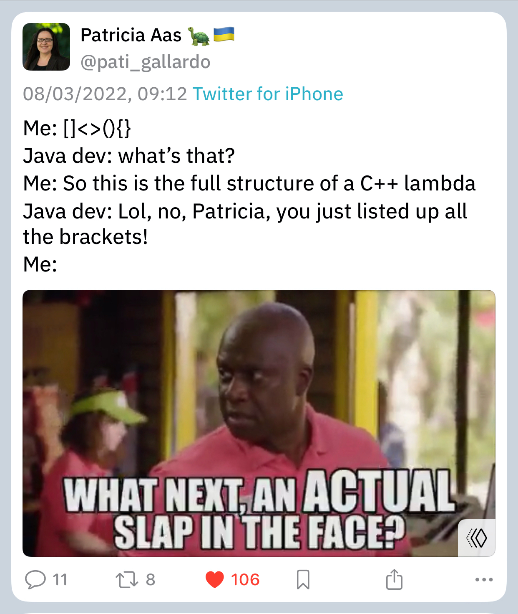

# Stash

## Video: Secure Programming Practices in C++ - NDC Security 2018

[YouTube](https://www.youtube.com/watch?v=Jh0G_A7iRac)

## Video: C++ Performance and Optimisation - NDC Techtown 2017

[YouTube](https://www.youtube.com/watch?v=eICYHA-eyXM)

## Video: Concurrent Programming in C++ - NDC Techtown 2017

[YouTube](https://www.youtube.com/watch?v=O7gUNNYjmsM)

## Video: CppCon 2016: "C++14 Reflections Without Macros, Markup nor External Tooling"

[YouTube](https://www.youtube.com/watch?v=abdeAew3gmQ)

## How to Adopt Modern C++17 into Your C++ Code, by Herb Sutter

* [YouTube](https://www.youtube.com/watch?v=UsrHQAzSXkA)

## Using metaprogramming for PIMPL idiom

* [Reddit](https://www.reddit.com/r/cpp/comments/7971ws/using_metaprogramming_for_pimpl_idiom/)

## Your own type predicate

* [Part 1](https://akrzemi1.wordpress.com/2017/12/02/your-own-type-predicate/)
* [Part 2](https://akrzemi1.wordpress.com/2017/12/20/a-friendly-type-predicate/)

## Tick: Trait introspection and concept creator for C++11

* [GitHub](https://github.com/pfultz2/Tick)

## Converting enum classes to strings and back in C++

* [Article](https://sheep.horse/2018/5/converting_enum_classes_to_strings_and_back_in_c++.html)
* [Reddit](https://www.reddit.com/r/cpp/comments/8hwk91/converting_enum_classes_to_strings_and_back_in_c/)

## Rvalues redefined

* [Post](https://akrzemi1.wordpress.com/2018/05/16/rvalues-redefined/)

## eventpp -- C++ library for event dispatcher and callback list

* [GitHub](https://github.com/wqking/eventpp)

## Multifunction: Generalization of `std::function` for any number of signatures

* [Code](https://github.com/fgoujeon/multifunction)

## How to Use Tag Dispatching In Your Code Effectively

* [Post](http://www.fluentcpp.com/2018/04/27/tag-dispatching/)

## Embracing Algorithms, by Dave Abrahams (WWDC2018)

* [Video](https://developer.apple.com/videos/play/wwdc2018/223/)
* [Reddit](https://www.reddit.com/r/cpp/comments/8pqtr1/dave_abrahams_on_embracing_algorithms_at_wwdc_2018/)

> I guess most of you know who Dave Abrahams is and what he has done in the C++ community. He
> switched gears a little and is now working at Apple focusing mostly on the development of the
> Swift language and its library. However, yesterday he gave an excellent talk at their Developer
> Conference entitled Embracing Algorithms, which IMHO is general enough to be of interest for C++
> developers as well. The link has a video of that 40 minutes long talk as well as the slides.

## Matt Godbolt (2017-06-27) - Memory and Caches

* [Video](https://www.youtube.com/watch?v=vDns3Um39l0)

## David Friberg - Three interesting minor features of C++20

* [YouTube](https://youtube.com/watch?v=4AQulaRJGMc)
* [Slides](https://dfrib.github.io/presentations/2020cw50_Gbgcpp_MinorCpp20Features.html)

## Video: Timur Doumler - How C++20 changes the way we write code - Meeting C++ 2020

* [YouTube](https://youtu.be/VK-16tpFQVI)
  * [Reddit](https://www.reddit.com/r/cpp/comments/lo4z89/timur_doumler_how_c20_changes_the_way_we_write/?ref=share&ref_source=link)

## A tutorial and take on C++20 coroutines

* [David Mazières](https://www.scs.stanford.edu/~dm/blog/c++-coroutines.html)
  * [Reddit](https://www.reddit.com/r/cpp/comments/lpo9qa/my_tutorial_and_take_on_c20_coroutines_david/)

## C++ and Rust interoperability

An article was published on the [Tetrane blog](https://blog.tetrane.com/2022/Rust-Cxx-interop.html) describing the current state of Rust and C++ interoperability. The article explains all the available options in detail, including code snippets, but for a short summary let's read a [comment](https://www.reddit.com/r/cpp/comments/tka2an/a_tour_of_rust_c_interoperability/i1pmxow/) on the Reddit [thread](https://www.reddit.com/r/cpp/comments/tka2an/a_tour_of_rust_c_interoperability/) by the original poster:

> The post proposes 3 approaches based on 3 available libraries in the Rust ecosystem:
>
> - **bindgen**: Start from the C or C++ headers of a C/C++ library and generate Rust code that exposes functions able to call the C/C++ library. Then you can just link with this library (statically or dynamically) and call its functions! It is automatic, but it doesn't attempt to reconcile the differences of concepts between C++ and Rust, and more importantly, it doesn't attempt to translate what C++ and Rust have in common (iterators, vectors, `string`, `unique_ptr`, `shared_ptr`, ...), so it is best suited for very "C-like" libraries.
>
> - **cpp** uses Rust's macro system to let you write C++ inline inside of your Rust. The C++ snippets are then compiled by a C++ compiler, and the Rust code to call them using the C ABI is generated. Since the C++ snippets are C++, you can directly call other C++ libs from the C++ snippets. However the boundary between C++ and Rust remains somewhat low-level with this solution (it has native understanding of `unique_ptr`s but that's pretty much it).
>
> - **cxx**: uses Rust's macro system to let you declare a special Rust module containing items (types, functions) to be either shared (understood by both C++ and Rust, and passed by value between the languages) or opaquely exposed from one language to the other (you'll need to manipulate the type behind a pointer when on the other language). This approach is nice because it pre-binds for you some C++/Rust standard types (vectors, strings) and concept (exceptions and Rust's `Result` type).
>
> At the basic levels, all three libraries are built upon the C ABI/API, since it is the common language that both Rust and C++ understand. In cxx however you don't really see the use of the basic C API since some higher-level concepts are translated between C++ and Rust.

I read that Microsoft is exploring Rust for some of their code bases, wonder what they'll use if they need C++ interop.

## Minimum viable declarative GUI in C++

Jean-Michaël Celerier wrote an [article](https://ossia.io/posts/minimum-viable/) that introduces a minimal declarative C++ GUI library. Like, really minimal, where declaring a struct is enough to define a user interface. Later this declaration is included in another 'magical' file which produces the declared UI. The resulting interface can be rendered by Qt via QML or another backend, like [Nuklear](https://github.com/Immediate-Mode-UI/Nuklear) (a C-based immediate mode UI engine).

An example UI declaration is on [GitHub](https://github.com/celtera/avendish/blob/main/examples/Ui.hpp).

In the [Reddit thread](https://www.reddit.com/r/cpp/comments/tkcmze/minimum_viable_declarative_gui_in_c/), people are generally impressed, but not when they discover all the macros the author had to add to improve the syntax.

Also, the code is under GPLv3, so be careful not to remember any of it or you'll have to open-source your brain.

## Twitter

Viktor Zverovich (@vzverovich):

Patricia Aas (@pati_gallardo):

Patricia Aas again (@pati_gallardo):

