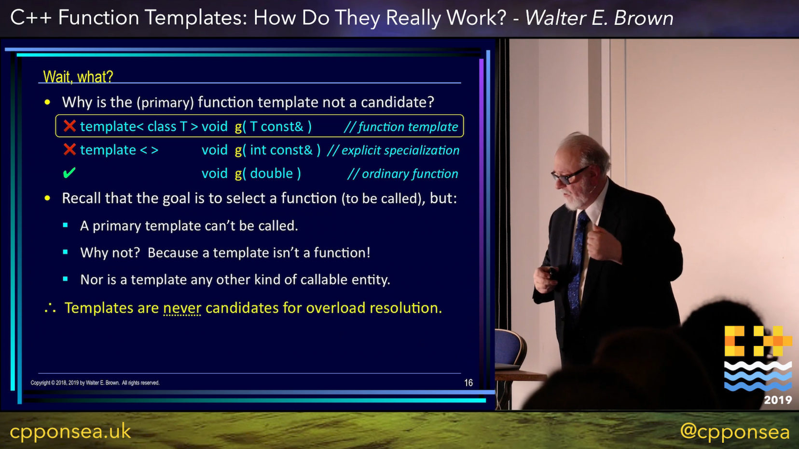
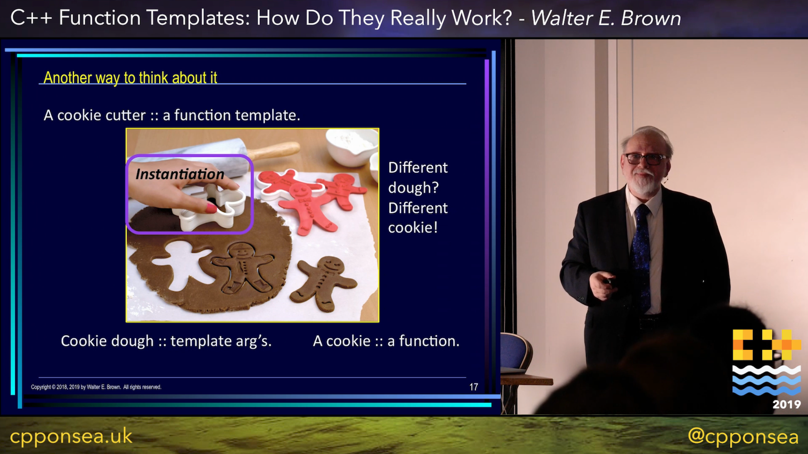
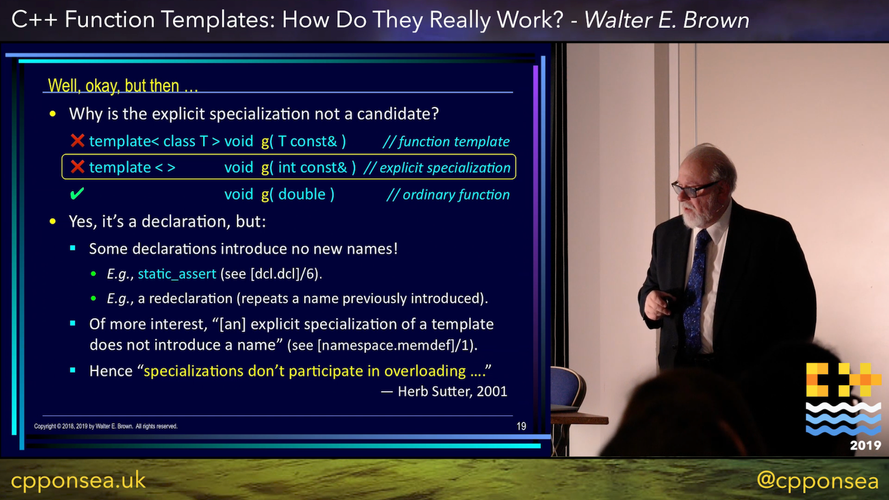
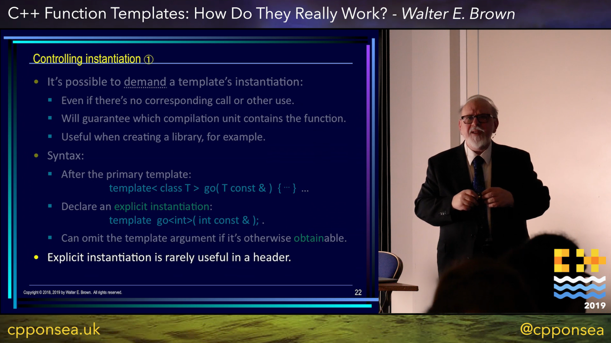
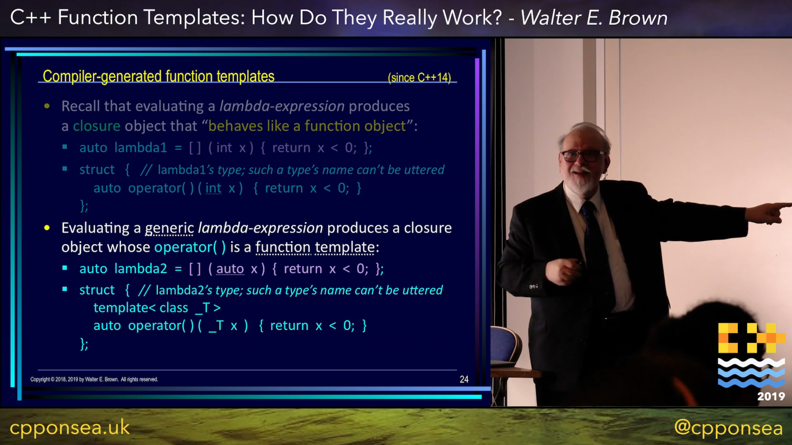
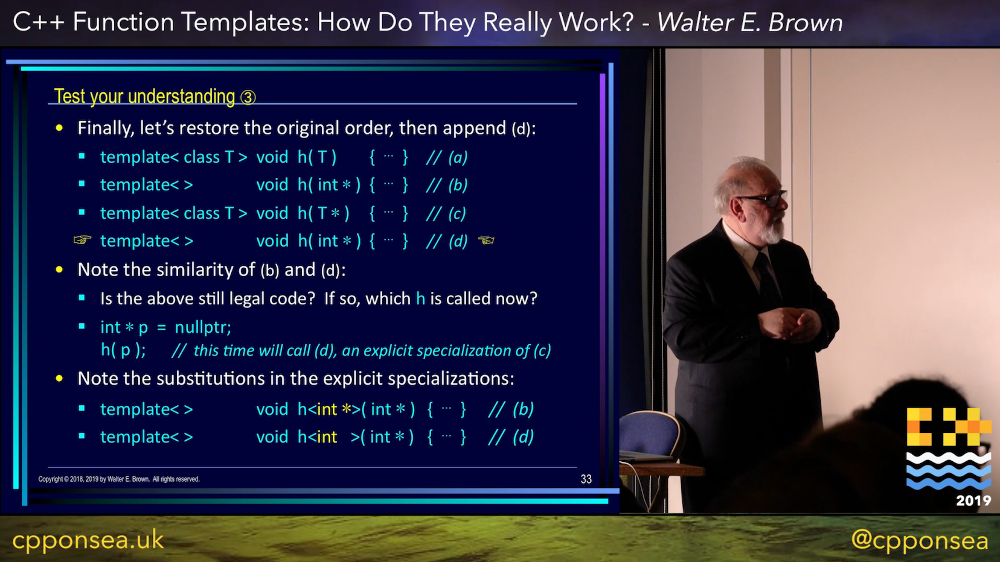
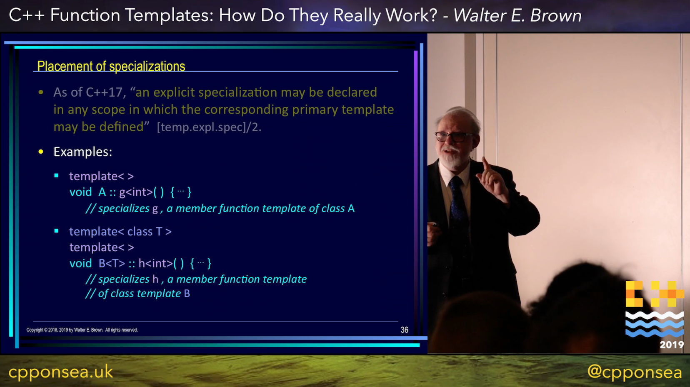
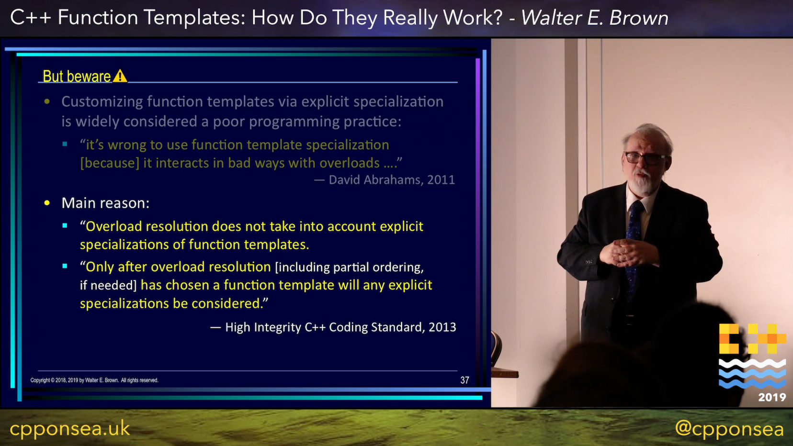
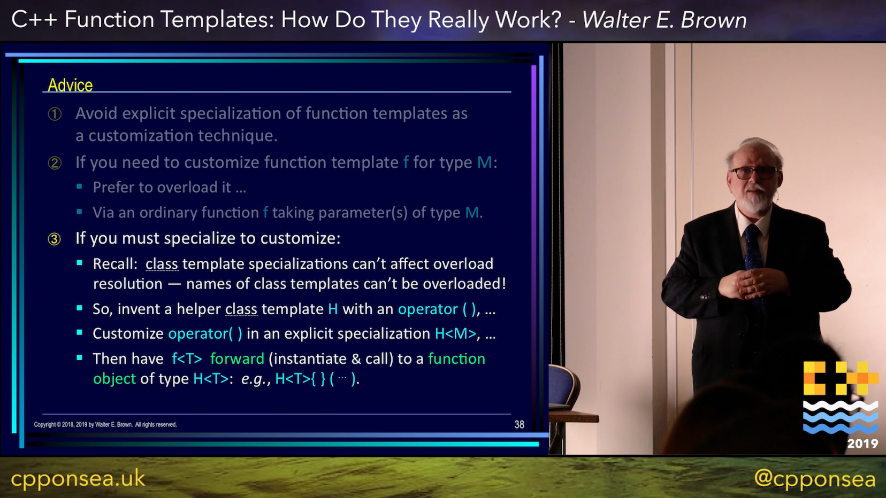
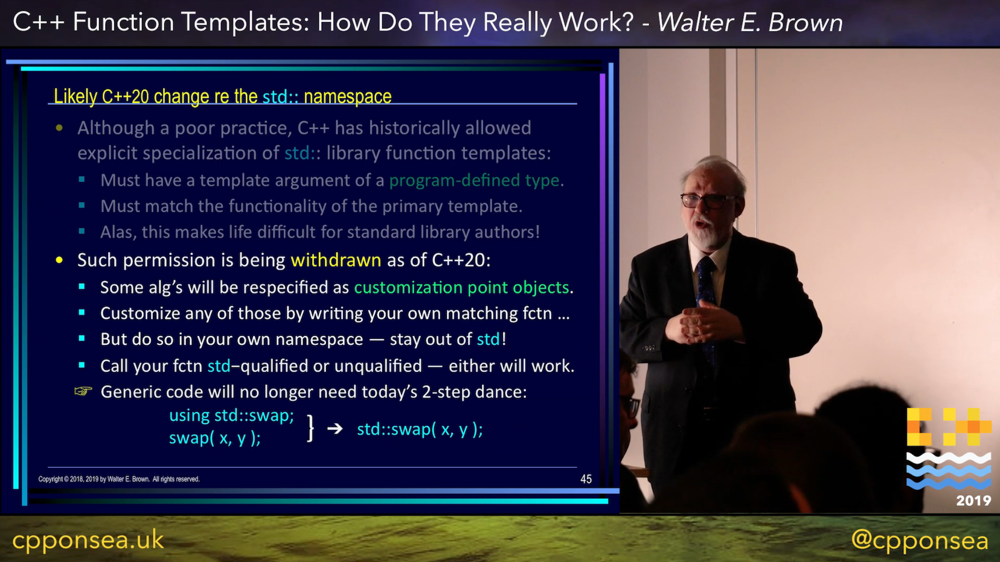

=====
Stash
=====

Remote Development with CLion, by Phil Nash
-------------------------------------------

* https://youtu.be/g1zPcja3zAU
* https://www.reddit.com/r/cpp/comments/axw18q/remote_development_with_clion/

C++ On Sea 2019 - Walter E. Brown - C++ Function Templates: How Do They Really Work?
------------------------------------------------------------------------------------

https://youtu.be/nfIX8yWlByY

.. image:: img/brown-fn-templ-1.png

C++ On Sea 2019 - Walter E. Brown - C++ Function Templates: How Do They Really Work?
------------------------------------------------------------------------------------

https://youtu.be/nfIX8yWlByY

.. image:: img/brown-fn-templ-2.png

C++ On Sea 2019 - Walter E. Brown - C++ Function Templates: How Do They Really Work?
------------------------------------------------------------------------------------

https://youtu.be/nfIX8yWlByY

C++ On Sea 2019 - Walter E. Brown - C++ Function Templates: How Do They Really Work?
------------------------------------------------------------------------------------

https://youtu.be/nfIX8yWlByY

C++ On Sea 2019 - Walter E. Brown - C++ Function Templates: How Do They Really Work?
------------------------------------------------------------------------------------

https://youtu.be/nfIX8yWlByY

.. image:: img/brown-fn-templ-5.png

C++ On Sea 2019 - Walter E. Brown - C++ Function Templates: How Do They Really Work?
------------------------------------------------------------------------------------

https://youtu.be/nfIX8yWlByY

C++ On Sea 2019 - Walter E. Brown - C++ Function Templates: How Do They Really Work?
------------------------------------------------------------------------------------

https://youtu.be/nfIX8yWlByY

.. image:: img/brown-fn-templ-7.png

C++ On Sea 2019 - Walter E. Brown - C++ Function Templates: How Do They Really Work?
------------------------------------------------------------------------------------

https://youtu.be/nfIX8yWlByY

C++ On Sea 2019 - Walter E. Brown - C++ Function Templates: How Do They Really Work?
------------------------------------------------------------------------------------

https://youtu.be/nfIX8yWlByY

.. image:: img/brown-fn-templ-9.png

C++ On Sea 2019 - Walter E. Brown - C++ Function Templates: How Do They Really Work?
------------------------------------------------------------------------------------

https://youtu.be/nfIX8yWlByY

C++ On Sea 2019 - Walter E. Brown - C++ Function Templates: How Do They Really Work?
------------------------------------------------------------------------------------

https://youtu.be/nfIX8yWlByY

.. image:: img/brown-fn-templ-11.png

C++ On Sea 2019 - Walter E. Brown - C++ Function Templates: How Do They Really Work?
------------------------------------------------------------------------------------

https://youtu.be/nfIX8yWlByY

.. image:: img/brown-fn-templ-12.png

C++ On Sea 2019 - Walter E. Brown - C++ Function Templates: How Do They Really Work?
------------------------------------------------------------------------------------

https://youtu.be/nfIX8yWlByY

.. image:: img/brown-fn-templ-13.png

C++ On Sea 2019 - Walter E. Brown - C++ Function Templates: How Do They Really Work?
------------------------------------------------------------------------------------

https://youtu.be/nfIX8yWlByY

.. image:: img/brown-fn-templ-14.png

C++ On Sea 2019 - Walter E. Brown - C++ Function Templates: How Do They Really Work?
------------------------------------------------------------------------------------

https://youtu.be/nfIX8yWlByY

.. image:: img/brown-fn-templ-15.png

C++ On Sea 2019 - Walter E. Brown - C++ Function Templates: How Do They Really Work?
------------------------------------------------------------------------------------

https://youtu.be/nfIX8yWlByY

.. image:: img/brown-fn-templ-16.png

C++ On Sea 2019 - Walter E. Brown - C++ Function Templates: How Do They Really Work?
------------------------------------------------------------------------------------

https://youtu.be/nfIX8yWlByY

C++ On Sea 2019 - Walter E. Brown - C++ Function Templates: How Do They Really Work?
------------------------------------------------------------------------------------

https://youtu.be/nfIX8yWlByY

.. image:: img/brown-fn-templ-18.png

C++ On Sea 2019 - Walter E. Brown - C++ Function Templates: How Do They Really Work?
------------------------------------------------------------------------------------

https://youtu.be/nfIX8yWlByY

C++ On Sea 2019 - Walter E. Brown - C++ Function Templates: How Do They Really Work?
------------------------------------------------------------------------------------

https://youtu.be/nfIX8yWlByY

C++ On Sea 2019 - Walter E. Brown - C++ Function Templates: How Do They Really Work?
------------------------------------------------------------------------------------

https://youtu.be/nfIX8yWlByY

C++ On Sea 2019 - Walter E. Brown - C++ Function Templates: How Do They Really Work?
------------------------------------------------------------------------------------

https://youtu.be/nfIX8yWlByY

.. image:: img/brown-fn-templ-22.png

C++ On Sea 2019 - Walter E. Brown - C++ Function Templates: How Do They Really Work?
------------------------------------------------------------------------------------

https://youtu.be/nfIX8yWlByY

.. image:: img/brown-fn-templ-23.png

C++ On Sea 2019 - Walter E. Brown - C++ Function Templates: How Do They Really Work?
------------------------------------------------------------------------------------

https://youtu.be/nfIX8yWlByY

.. image:: img/brown-fn-templ-24.png

C++ On Sea 2019 - Walter E. Brown - C++ Function Templates: How Do They Really Work?
------------------------------------------------------------------------------------

https://youtu.be/nfIX8yWlByY

C++ On Sea 2019 - Walter E. Brown - C++ Function Templates: How Do They Really Work?
------------------------------------------------------------------------------------

https://youtu.be/nfIX8yWlByY

.. image:: img/brown-fn-templ-26.png

C++ On Sea 2019 - Walter E. Brown - C++ Function Templates: How Do They Really Work?
------------------------------------------------------------------------------------

https://youtu.be/nfIX8yWlByY

.. image:: img/brown-fn-templ-27.png

C++ On Sea 2019 - Walter E. Brown - C++ Function Templates: How Do They Really Work?
------------------------------------------------------------------------------------

https://youtu.be/nfIX8yWlByY

.. image:: img/brown-fn-templ-28.png

C++ On Sea 2019 - Walter E. Brown - C++ Function Templates: How Do They Really Work?
------------------------------------------------------------------------------------

https://youtu.be/nfIX8yWlByY

.. image:: img/brown-fn-templ-29.png

What is the Strict Aliasing Rule and Why do we care?
----------------------------------------------------

(OR Type Punning, Undefined Behavior and Alignment, Oh My!)

https://gist.github.com/shafik/848ae25ee209f698763cffee272a58f8

C++, it’s not you. It’s me.
---------------------------

Blog post: https://c0de517e.blogspot.com/2019/02/c-its-not-you-its-me.html

    The crux of the issue <...> is the growing disconnect between people woking on big, complex, performance-sensitive and often monolithic and legacy-ridden codebases that we find in game development, and the ideas of "modernity” of the C++ standard community.

`Reddit <https://www.reddit.com/r/cpp/comments/av8mmz/c_its_not_you_its_me/>`_

    I'm just going to throw it out there: I'm tired of reading this kind of stuff from game devs. There's just so much of this kind of stuff.

    Acting like they are the only ones with performance issues. The only ones with complex codebases. The only ones who actually ship code. The ones who are just solving more unique and difficult problems than anyone else, for which c++ falls short by more.
